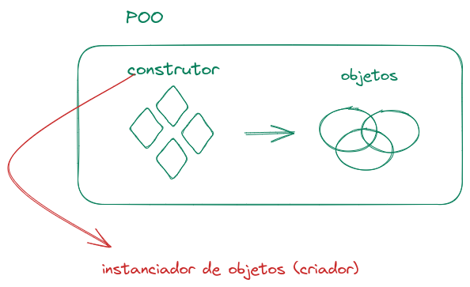
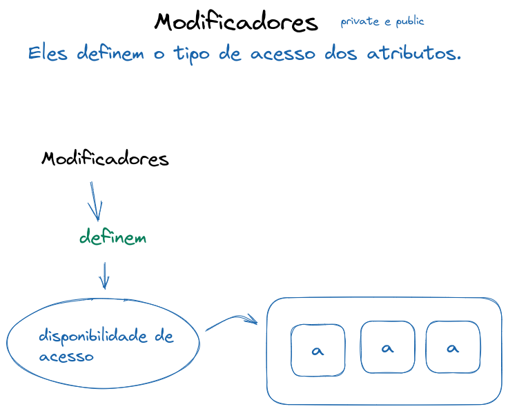
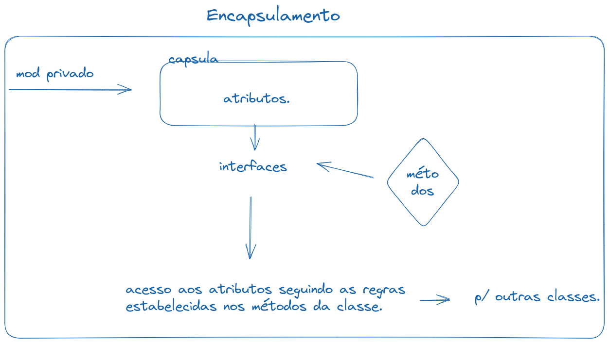

### Missão I

Construirmos juntos uma representação visual de todos os conceitos que estudamos essa semana. 

- POO
- Objetos
- Classes
- Atributos
- Métodos
- Construtores
- Modificadores
- Encapsulamento

#### Diagramas construídos na aula

